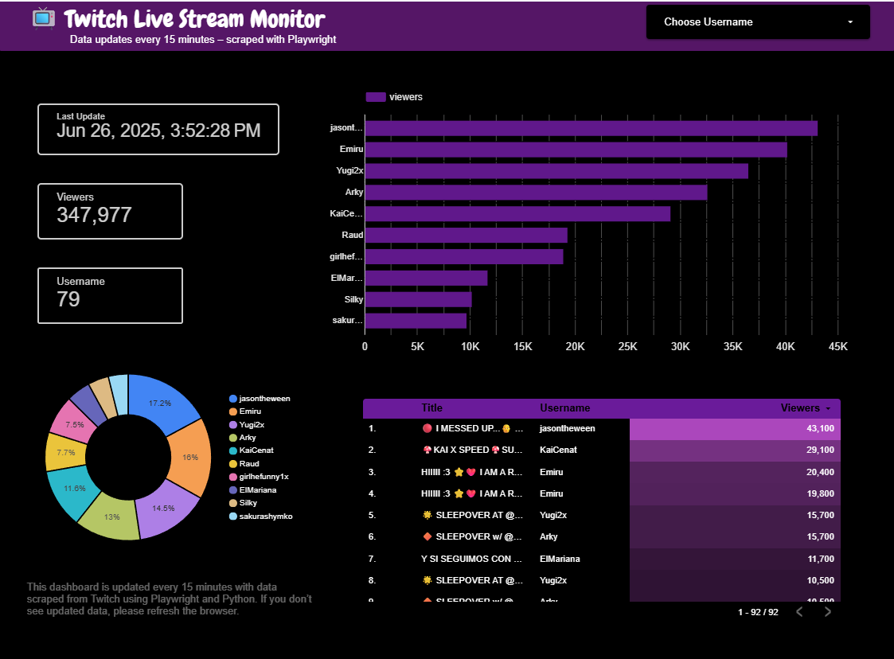

# Data Automation Project – Real-Time Web Scraping to Dynamic Reporting

A Python automation project that scrapes real-time Twitch stream data using Playwright, stores the results into Google Sheets, and visualizes the data dynamically using Looker Studio.

This project is designed to demonstrate an end-to-end automation workflow:
**Web Scraping → Data Pipeline → Google Sheets → Looker Studio Dashboard**.

---

## 🚀 Features
- Scrape Twitch stream data automatically using Playwright
- Extract structured data such as:
  - Stream title
  - Streamer username
  - Viewers count
  - Timestamp
- Store results into Google Sheets (real-time update)
- Avoid duplicate records (basic validation & deduplication)
- Schedule scraping automatically using `scheduler.py`
- Visualize updated data instantly in Looker Studio

---

## 📊 Dashboard Preview (Looker Studio Screenshot)


---

## 🛠 Tech Stack
- Python
- Playwright
- Google Sheets API (gspread)
- Looker Studio
- dotenv (.env configuration)
- schedule (automation scheduler)

## ⚙️ Installation
#### 1. Clone Repository

```bash
git clone https://github.com/AqilaFadia/twitch-scraper-playwright.git
cd twitch-scraper-playwright
```
#### 2. Install Dependencies
```bash
pip install -r requirements.txt
```
#### 4. Install Playwright Browsers
```bash
playwright install
```
## 🔑 Google Sheets API Setup (Credentials JSON)

This project uses Google Sheets API via Service Account.
#### Step 1: Create Google Cloud Project
Go to Google Cloud Console
Create a new project
#### Step 2: Enable Google Sheets API
Go to APIs & Services → Library
Search for Google Sheets API
Click Enable
#### Step 3: Create Service Account
Go to APIs & Services → Credentials
Click Create Credentials → Service Account
Fill service account name
#### Step 4: Generate JSON Key File
Open your service account
Go to Keys
Click Add Key → Create new key
Select JSON
Download the JSON file

Rename it to:

```bash
credentials.json
```

Place it inside the project folder.

#### Step 5: Share Spreadsheet Access
Open your Google Spreadsheet
Click Share

Add the email from your service account JSON file
Example:
```
your-service-account@project-name.iam.gserviceaccount.com
```

Give Editor access
🔧 Environment Variables (.env Setup)

### Create a .env file in the root folder.

Example:
```bash
SPREADSHEET_NAME=Twitch Stream Data
WORKSHEET_NAME=Sheet1
```

📌 Notes:

SPREADSHEET_NAME = your Google Spreadsheet name
WORKSHEET_NAME = the tab name inside spreadsheet
GOOGLE_CREDENTIALS_FILE = JSON credential filename

### To scrape Twitch data one time:
```bash
python main.py
```
### Run Scraper Automatically (Scheduler)
To run scraping repeatedly on schedule:
```bash
python scheduler.py
```
You can configure the interval inside scheduler.py.

Example:
```bash
schedule.every(15).minutes.do(main)
```

⚠️ Notes
This project collects only publicly available Twitch stream information.
Twitch may apply bot protection or rate limits depending on scraping frequency.
Use reasonable delays to avoid being blocked.
